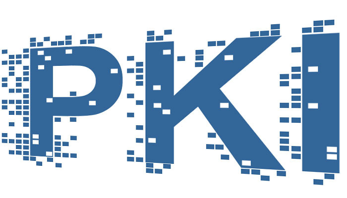
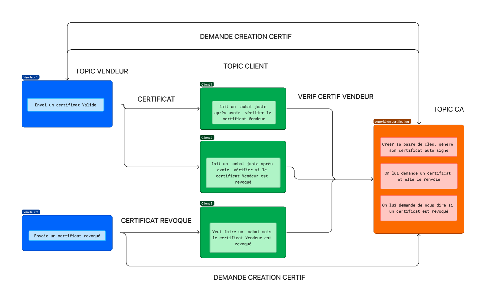

# PKI Projet PKI pour Sécuriser les Transactions MQTT

<div id="haut"></div>

<br>
<!-- PROJECT LOGO -->
<div align="center">
  <a href="#">
    
  </a>
</div>

</br>

<p align="center">
  L'objectif principal de ce projet est de mettre en place une infrastructure de gestion des clés publiques (PKI) pour sécuriser les transactions entre des clients et des vendeurs via un broker MQTT. Ce système permet de garantir l'intégrité, l'authenticité et la confidentialité des communications en utilisant des certificats numériques et des paires de clés RSA. La solution développée intègre des composants logiciels pour la génération, la gestion et la validation des certificats, tout en s'assurant que les messages échangés sont sécurisés par des techniques de chiffrement.
</p>

---

## Table of Contents

<details open>
  <summary>Cliquer ici pour développer la Table des Matières</summary>
  <ol>
    <li>
      <a href="#aperçu">Aperçu</a>
      <ul>
        <li><a href="#description-du-projet">Description du Projet</a></li>
        <li><a href="#architecture-du-système">Architecture du Système</a></li>
      </ul>
    </li>
    <li>
      <a href="#à-propos-du-projet">À Propos du Projet</a>
      <ul>
        <li><a href="#fonctionnalités-clés">Fonctionnalités Clés</a></li>
      </ul>
    </li>
    <li><a href="#démarrage">Démarrage</a></li>
    <ul>
      <li><a href="#installation">Installation</a></li>
      <li><a href="#pré-requis">Pré-requis</a></li>
    </ul>
    <li><a href="#tests-unitaires">Tests Unitaires</a></li>
    <li><a href="#contributeurs">Contributeurs</a></li>
  </ol>
</details>

---

## Aperçu

### Description du Projet

Ce projet consiste à créer une infrastructure de gestion des clés publiques (PKI) pour sécuriser les transactions effectuées via le protocole MQTT. Le système inclut la génération de paires de clés RSA, la création de certificats auto-signés, et la gestion de certificats révoqués.

### Architecture du Système

L'architecture du système comprend les composants suivants :

1. Génération de Clés : Génération de paires de clés RSA (publique et privée).
2. Certificats Auto-signés : Création de certificats auto-signés pour les entités.
3. Gestion des Certificats Révoqués : Maintien d'une liste de certificats révoqués (CRL).
4. Broker MQTT : Utilisation de Mosquitto pour la gestion des communications MQTT entre les clients et les vendeurs.

### Diagramme d'Architecture du Système



---

## À Propos du Projet

Le projet PKI pour MQTT a été développé pour démontrer comment sécuriser les communications dans un réseau utilisant le protocole MQTT. Le projet met en œuvre une infrastructure PKI qui permet de garantir l'authenticité et la confidentialité des messages échangés.

### Fonctionnalités Clés

- **Génération de Clés RSA**: Génère des paires de clés publique et privée.
- **Certificats Auto-signés**: Crée des certificats numériques auto-signés.
- **Vérification des Certificats**: Vérifie la validité et la révocation des certificats.
- **Gestion des Certificats Révoqués**: Maintient et vérifie une liste de révocation des certificats (CRL).
- **Sécurisation des Communications MQTT**: Utilise des certificats pour sécuriser les transactions MQTT.

---

## Démarrage

Pour configurer le projet localement, suivez ces étapes :

### Installation

1. **Cloner le Répertoire**: Clonez le répertoire sur votre machine locale :

   ```bash
   git clone https://github.com/idrissa010/projectPki.git
   ```

2. **Naviguer dans le Répertoire du Projet**: Accédez au répertoire du projet :

   ```bash
   cd projectPki
   ```

### Exécution

Pour lancer les différents composants du projet, utilisez les commandes suivantes :

1. **PKI**:

   ```bash
   cd pki
   python3 pki.py
   ```

1. **Vendeur**:

   ```bash
   cd vendeur
   python3 vendeur.py
   ```

1. **Client**:

   ```bash
   cd client
   python3 client.py
   ```

---

### Pré-requis

Liste des pré-requis ou dépendances nécessaires avant d'utiliser le projet.

- **Python**: Assurez-vous que Python est installé sur votre système. Si ce n'est pas le cas, vous pouvez le télécharger et l'installer depuis le [site officiel de Python](https://www.python.org/downloads/).
- **MQTT Broker (Mosquitto)**: Installez Mosquitto pour gérer les communications MQTT. Suivez le guide d'installation officiel [lien Broker](https://mosquitto.org/download/).
- **Bibliothèques Python**: Installez les bibliothèques nécessaires :

  ```bash
  pip install -r requirements.txt
  ```

---

## Contributeurs

Merci aux contributeurs suivants pour leurs précieuses contributions à ce projet :

<br>

<dive style="display: block">
<div style="display: flex; flex-wrap: wrap;">
  <div style="display: flex; align-items: center; margin-right: 20px;">
    
    <a href="https://github.com/Rahim21" style="text-decoration: none;">Rahim</a>
  </div>
</div>

<br>

<dive style="display: block">
<div style="display: flex; flex-wrap: wrap;">
  <div style="display: flex; align-items: center; margin-right: 20px;">
    
    <a href="https://github.com/sami51100" style="text-decoration: none;">Sami</a>
  </div>
</div>

<br>

<dive style="display: block">
<div style="display: flex; flex-wrap: wrap;">
  <div style="display: flex; align-items: center; margin-right: 20px;">
    
    <a href="https://github.com/Idrissa010" style="text-decoration: none;">Idrissa</a>
  </div>
</div>
<br></br>

---

<p align="right">(<a href="#top">remonter en haut de la page</a>)</p>

<!-- Markdown Links & Images -->

[System Architecture Diagram]: pictures/system_architecture.png
